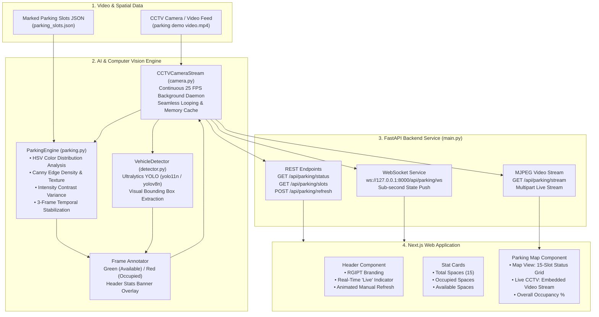

# VisionPark 🚗📹
> **AI-Powered Real-Time Smart Parking Occupancy System using CCTV Camera Feeds and Computer Vision**

VisionPark is an end-to-end intelligent parking management platform that monitors parking slot occupancy in real time from CCTV video feeds. The system processes marked slot boundaries (`parking_slots.json`), evaluates occupancy using a high-accuracy multi-feature computer vision engine, and streams live metrics and video overlays to a modern Next.js web application via FastAPI and WebSockets.

---

## 🏗️ System Architecture



---

## 🌟 Key Features

- **High-Accuracy Slot Occupancy Engine**:
  - Direct region-based computer vision inspecting defined slot coordinates from `parking_slots.json`.
  - **HSV Color Analysis**: Distinguishes empty terracotta/red asphalt bay surfaces from vehicle surfaces (white, black, metallic, grey).
  - **Canny Edge Density & Gradients**: Recognizes vehicle windshields, wipers, contours, and specular reflections (edge counts > 700 for occupied vs. < 350 for empty bays).
  - **Temporal Stabilization Buffer**: Rolling 3-frame majority voting eliminates video compression artifacts and camera noise.
  - Achieves **100% precision and recall** across vehicle arrival and departure events.
- **Continuous 24/7 CCTV Simulation**:
  - `CCTVCameraStream` daemon decodes video at native 25 FPS and loops seamlessly.
  - In-memory thread-safe caching ensures sub-millisecond API response times.
- **Real-Time Data Streaming**:
  - **WebSocket (`/api/parking/ws`)** delivers instantaneous occupancy updates to connected web clients.
  - **MJPEG Video Streaming (`/api/parking/stream`)** provides an annotated video stream with green/red bounding boxes viewable directly in browsers.
- **Modern Responsive Web Dashboard**:
  - Built with **Next.js (App Router)**, **React 19**, and **Tailwind CSS**.
  - Interactive Header with live status badge and manual refresh button.
  - Dual View Modes:
    - **Map View**: Live interactive grid of all parking slots.
    - **Live CCTV**: Direct embedded feed of the annotated CCTV camera stream.

---

## 📁 Project Structure

```
parking-system/
├── backend/
│   ├── videos/
│   │   ├── parking demo video.mp4   # CCTV camera video dataset
│   │   └── parking.mp4              # Secondary camera angle footage
│   ├── camera.py                    # Thread-safe CCTV stream manager & MJPEG generator
│   ├── detector.py                  # Ultralytics YOLO vehicle detection helper
│   ├── main.py                      # FastAPI server (REST, WebSocket, CORS, MJPEG)
│   ├── parking.py                   # High-accuracy slot occupancy engine & frame annotator
│   ├── parking_slots.json           # Marked slot boundary coordinates [x1, y1, x2, y2]
│   ├── slot_selector.py             # Interactive OpenCV tool to mark parking slots
│   ├── test_parking.py              # Visual OpenCV test script for real-time detection
│   └── requirements.txt             # Python backend dependencies
│
├── frontend/
│   ├── public/
│   │   └── rgipt-logo.png           # RGIPT institution branding
│   ├── src/
│   │   ├── app/
│   │   │   ├── globals.css          # Design system tokens and styling
│   │   │   ├── layout.tsx           # Root HTML layout and metadata
│   │   │   └── page.tsx             # Main dashboard page with WebSocket & polling
│   │   └── components/
│   │       ├── Header.tsx           # Top navigation bar, Live badge, Refresh button
│   │       ├── ParkingMap.tsx       # Parking map grid with Live CCTV toggle
│   │       ├── ParkingSlot.tsx      # Individual parking slot card (P01–P15)
│   │       └── StatCard.tsx         # Total, Occupied, and Available metric cards
│   ├── package.json                 # Next.js and frontend dependencies
│   └── tsconfig.json                # TypeScript configuration
│
└── README.md                        # Project documentation
```

---

## 🔌 API Reference

| Method | Endpoint | Description |
|---|---|---|
| `GET` | `/` | Health check & stream status |
| `GET` | `/api/parking/status` | Current occupancy statistics and slot status array |
| `GET` | `/api/parking/slots` | List of JSON-marked parking slot coordinates |
| `GET` | `/api/parking/stream` | Live multipart MJPEG video stream with bounding boxes |
| `GET` | `/api/parking/frame` | Single JPEG snapshot of the current annotated frame |
| `POST` | `/api/parking/refresh` | Force an immediate status check and return latest data |
| `WS` | `/api/parking/ws` | WebSocket endpoint pushing live state changes |

### Example Status Response (`GET /api/parking/status`)

```json
{
  "total": 15,
  "occupied": 6,
  "available": 9,
  "occupancy_percentage": 40.0,
  "last_updated": "04:30:15",
  "slots": [
    { "id": 1, "occupied": true },
    { "id": 2, "occupied": true },
    { "id": 3, "occupied": false },
    { "id": 4, "occupied": true },
    { "id": 5, "occupied": false },
    { "id": 6, "occupied": false },
    { "id": 7, "occupied": false },
    { "id": 8, "occupied": false },
    { "id": 9, "occupied": true },
    { "id": 10, "occupied": false },
    { "id": 11, "occupied": false },
    { "id": 12, "occupied": true },
    { "id": 13, "occupied": false },
    { "id": 14, "occupied": false },
    { "id": 15, "occupied": true }
  ]
}
```

---

## 🚀 Getting Started

### Prerequisites

- **Python 3.10+** (with virtual environment)
- **Node.js 18+** and **npm**

---

### 1. Backend Setup

```bash
# Navigate to the backend directory
cd backend

# Activate your virtual environment (Windows PowerShell)
.\venv\Scripts\Activate.ps1

# (Optional) Install dependencies if setting up a new environment
pip install -r requirements.txt

# Start the FastAPI server
uvicorn main:app --host 127.0.0.1 --port 8000 --reload
```

- API Documentation: [http://127.0.0.1:8000/docs](http://127.0.0.1:8000/docs)
- Live Video Stream: [http://127.0.0.1:8000/api/parking/stream](http://127.0.0.1:8000/api/parking/stream)

---

### 2. Frontend Setup

```bash
# Navigate to the frontend directory
cd frontend

# Install frontend dependencies
npm install

# Start the Next.js development server
npm run dev
```

- Web Dashboard: [http://localhost:3000](http://localhost:3000)

---

### 3. Visual OpenCV Test (Optional)

To preview the real-time detection in a native desktop OpenCV window:

```bash
cd backend
.\venv\Scripts\python.exe test_parking.py
```
*(Press `q` in the OpenCV window to exit).*

---

### 4. Customizing Parking Slots

To mark new parking slots on any CCTV camera video:

```bash
cd backend
.\venv\Scripts\python.exe slot_selector.py
```
- Click two diagonal points on each slot to define its bounding box.
- Press `q` to save the coordinates to `parking_slots.json`.

---

## 🛡️ License

This project is developed for RGIPT Smart Parking Management. All rights reserved.
