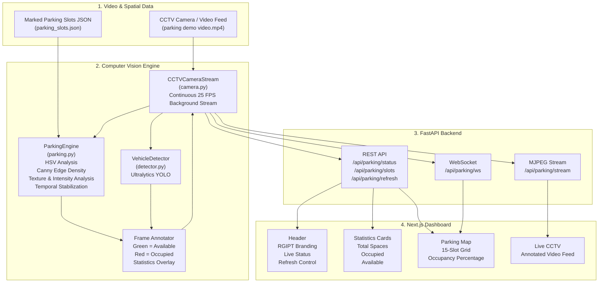

# VisionPark

## AI-Powered Real-Time Smart Parking Occupancy System

VisionPark is an end-to-end intelligent parking management platform that monitors parking slot occupancy in real time using CCTV camera feeds and computer vision.

The system uses predefined parking-slot boundaries from `parking_slots.json`, analyzes each slot using a multi-feature computer vision engine, detects vehicles using YOLO, and provides real-time occupancy data and annotated video through a FastAPI backend and a modern Next.js web dashboard.

---

## Overview

VisionPark is designed to transform a conventional CCTV-based parking system into an intelligent monitoring platform.

The system:

* Processes live or prerecorded CCTV footage.
* Detects whether individual parking slots are occupied.
* Combines region-based computer vision with YOLO vehicle detection.
* Stabilizes occupancy predictions across multiple frames.
* Provides real-time parking statistics through REST APIs and WebSockets.
* Streams an annotated CCTV feed through an MJPEG endpoint.
* Displays parking availability through a responsive web dashboard.

---

## System Architecture



---

## Key Features

### 1. Multi-Feature Parking Occupancy Detection

VisionPark evaluates each predefined parking region directly from the CCTV frame.

The occupancy engine combines multiple visual characteristics:

#### HSV Color Analysis

The system analyzes the HSV color distribution inside each parking region to distinguish between an empty parking surface and vehicle surfaces.

This allows the detector to use differences in:

* Hue
* Saturation
* Brightness
* Dominant surface colors

#### Canny Edge Detection

Canny edge analysis is used to measure structural complexity within a parking slot.

Vehicles typically introduce additional edges caused by:

* Windshields
* Vehicle contours
* Wipers
* Reflections
* Body panels
* Other visual structures

#### Texture and Intensity Analysis

The system also evaluates image texture, intensity variation, and local contrast to improve the distinction between empty and occupied regions.

#### Temporal Stabilization

Occupancy decisions are stabilized using a rolling three-frame majority vote.

This reduces false detections caused by:

* Camera noise
* Video compression
* Temporary lighting changes
* Single-frame detection errors

---

## Vehicle Detection with YOLO

VisionPark also includes a vehicle detection module based on Ultralytics YOLO.

Supported model variants can include:

* YOLO11n
* YOLOv8n

The detector extracts visual bounding boxes for vehicles in each frame and provides an additional source of information for occupancy analysis.

This complements the region-based parking-slot analysis and improves robustness in challenging scenes.

---

## Real-Time CCTV Processing

The `CCTVCameraStream` component provides continuous processing of CCTV footage.

Key capabilities include:

* Native 25 FPS video processing
* Background processing
* Seamless video looping
* Thread-safe frame caching
* Continuous occupancy updates
* Reuse of the latest processed frame for API clients

The architecture separates video acquisition from API requests so that clients can retrieve parking information without repeatedly decoding the source video.

---

## Real-Time Data Streaming

### REST API

The FastAPI backend exposes REST endpoints for retrieving parking information, slot coordinates, and manual refresh results.

### WebSocket

The WebSocket endpoint:

```text
ws://127.0.0.1:8000/api/parking/ws
```

provides real-time parking-state updates to connected clients.

This allows the frontend to update occupancy information without relying entirely on periodic polling.

### MJPEG Video Stream

The endpoint:

```text
http://127.0.0.1:8000/api/parking/stream
```

provides a live multipart MJPEG stream containing annotated frames.

Available slots are displayed in green, while occupied slots are displayed in red.

---

## Web Dashboard

The frontend is built using:

* Next.js
* React
* TypeScript
* Tailwind CSS
* Lucide React

The dashboard provides a real-time visualization of the parking facility.

### Header

The header includes:

* RGIPT branding
* Live system indicator
* Manual refresh control

### Statistics

The dashboard displays:

* Total parking spaces
* Occupied spaces
* Available spaces
* Overall occupancy percentage

### Parking Map

The parking map provides a visual representation of all defined parking slots.

For the current configuration, the system supports 15 parking slots:

```text
P01 P02 P03 P04 P05
P06 P07 P08 P09 P10
P11 P12 P13 P14 P15
```

Each slot changes its visual state according to the latest occupancy result.

### Live CCTV

Users can switch to a live CCTV view showing the annotated camera stream and current occupancy information.

---

## Project Structure

```text
parking-system/
│
├── backend/
│   ├── videos/
│   │   ├── parking demo video.mp4
│   │   └── parking.mp4
│   │
│   ├── camera.py
│   ├── detector.py
│   ├── main.py
│   ├── parking.py
│   ├── parking_slots.json
│   ├── slot_selector.py
│   ├── test_parking.py
│   └── requirements.txt
│
├── frontend/
│   ├── public/
│   │   └── rgipt-logo.png
│   │
│   ├── src/
│   │   ├── app/
│   │   │   ├── globals.css
│   │   │   ├── layout.tsx
│   │   │   └── page.tsx
│   │   │
│   │   └── components/
│   │       ├── Header.tsx
│   │       ├── ParkingMap.tsx
│   │       ├── ParkingSlot.tsx
│   │       └── StatCard.tsx
│   │
│   ├── package.json
│   └── tsconfig.json
│
└── README.md
```

---

## Component Responsibilities

| File                 | Description                                                                   |
| -------------------- | ----------------------------------------------------------------------------- |
| `camera.py`          | Handles continuous CCTV video processing, frame caching, and MJPEG generation |
| `detector.py`        | Provides YOLO-based vehicle detection                                         |
| `parking.py`         | Performs parking-slot occupancy analysis and frame annotation                 |
| `main.py`            | FastAPI application containing REST, WebSocket, CORS, and streaming services  |
| `parking_slots.json` | Stores parking-slot coordinates                                               |
| `slot_selector.py`   | Interactive tool for defining parking-slot boundaries                         |
| `test_parking.py`    | Standalone OpenCV script for testing parking detection                        |
| `page.tsx`           | Main Next.js dashboard                                                        |
| `Header.tsx`         | Dashboard header and live status controls                                     |
| `ParkingMap.tsx`     | Parking-slot visualization and CCTV view                                      |
| `ParkingSlot.tsx`    | Individual parking-slot component                                             |
| `StatCard.tsx`       | Reusable statistics card                                                      |

---

## API Reference

| Method | Endpoint               | Description                                        |
| ------ | ---------------------- | -------------------------------------------------- |
| `GET`  | `/`                    | Backend health check and stream status             |
| `GET`  | `/api/parking/status`  | Returns current parking statistics and slot states |
| `GET`  | `/api/parking/slots`   | Returns configured parking-slot coordinates        |
| `POST` | `/api/parking/refresh` | Forces an immediate parking-status refresh         |
| `GET`  | `/api/parking/frame`   | Returns the latest annotated JPEG frame            |
| `GET`  | `/api/parking/stream`  | Returns the live MJPEG video stream                |
| `WS`   | `/api/parking/ws`      | Sends real-time parking-state updates              |

---

## Example API Response

### `GET /api/parking/status`

```json
{
  "total": 15,
  "occupied": 6,
  "available": 9,
  "occupancy_percentage": 40.0,
  "last_updated": "04:30:15",
  "slots": [
    { "id": 1, "occupied": true },
    { "id": 2, "occupied": true },
    { "id": 3, "occupied": false },
    { "id": 4, "occupied": true },
    { "id": 5, "occupied": false },
    { "id": 6, "occupied": false },
    { "id": 7, "occupied": false },
    { "id": 8, "occupied": false },
    { "id": 9, "occupied": true },
    { "id": 10, "occupied": false },
    { "id": 11, "occupied": false },
    { "id": 12, "occupied": true },
    { "id": 13, "occupied": false },
    { "id": 14, "occupied": false },
    { "id": 15, "occupied": true }
  ]
}
```

---

## Technology Stack

### Backend

* Python
* FastAPI
* Uvicorn
* OpenCV
* NumPy
* Ultralytics YOLO
* WebSockets

### Computer Vision

* HSV color-space analysis
* Canny edge detection
* Texture analysis
* Intensity and contrast analysis
* Temporal stabilization
* YOLO object detection

### Frontend

* Next.js
* React
* TypeScript
* Tailwind CSS
* Lucide React

### Communication

* REST API
* WebSocket
* MJPEG streaming
* CORS

---

## Getting Started

### Prerequisites

Make sure the following software is installed:

* Python 3.10 or later
* Node.js 18 or later
* npm
* Git

---

## 1. Backend Setup

Navigate to the backend directory:

```powershell
cd backend
```

Create and activate a virtual environment if required:

```powershell
python -m venv venv
.\venv\Scripts\Activate.ps1
```

Install backend dependencies:

```powershell
pip install -r requirements.txt
```

Start the FastAPI server:

```powershell
uvicorn main:app --host 127.0.0.1 --port 8000 --reload
```

The backend will be available at:

```text
http://127.0.0.1:8000
```

FastAPI documentation:

```text
http://127.0.0.1:8000/docs
```

Live CCTV stream:

```text
http://127.0.0.1:8000/api/parking/stream
```

---

## 2. Frontend Setup

Open a new terminal and navigate to the frontend:

```powershell
cd frontend
```

Install dependencies:

```powershell
npm install
```

Start the Next.js development server:

```powershell
npm run dev
```

The dashboard will be available at:

```text
http://localhost:3000
```

---

## 3. Run the OpenCV Test

To test the parking detection system directly through OpenCV:

```powershell
cd backend
.\venv\Scripts\python.exe test_parking.py
```

Press:

```text
q
```

to close the OpenCV window.

---

## 4. Configure Parking Slots

VisionPark allows users to define parking-slot boundaries for a new CCTV camera angle.

Run the slot-selection tool:

```powershell
cd backend
.\venv\Scripts\python.exe slot_selector.py
```

Workflow:

1. Open the camera frame.
2. Click two diagonal points for each parking slot.
3. Continue selecting all required parking spaces.
4. Press `q` to save the selected coordinates.
5. The coordinates are written to:

```text
parking_slots.json
```

The occupancy engine then uses these coordinates for subsequent analysis.

---

## Parking Slot Configuration

A slot is represented by its bounding-box coordinates:

```json
{
  "id": 1,
  "x1": 100,
  "y1": 200,
  "x2": 180,
  "y2": 300
}
```

The coordinates define the rectangular region analyzed by the occupancy engine.

For best results:

* Keep slot boundaries aligned with the actual parking spaces.
* Avoid including large areas outside the parking space.
* Use a consistent camera angle.
* Ensure the video resolution remains consistent with the selected coordinates.

---

## Detection Pipeline

A typical frame passes through the following pipeline:

```text
CCTV Video
     |
     v
Frame Capture
     |
     v
Parking Slot Region Extraction
     |
     +----------------------+
     |                      |
     v                      v
Computer Vision         YOLO Detection
Analysis                Vehicle Detection
     |                      |
     +----------+-----------+
                |
                v
       Occupancy Decision
                |
                v
        Temporal Stabilization
                |
                v
         Frame Annotation
                |
        +-------+-------+
        |       |       |
        v       v       v
      REST   WebSocket  MJPEG
        |       |       |
        +-------+-------+
                |
                v
         Next.js Dashboard
```

---

## Performance and Reliability

The current system is designed for continuous CCTV simulation and real-time dashboard updates.

Important design considerations include:

* Background video processing prevents repeated frame decoding for each API request.
* In-memory frame caching reduces unnecessary processing.
* Temporal voting reduces short-lived classification errors.
* Region-based analysis keeps parking-slot evaluation computationally focused.
* YOLO detection provides an additional visual vehicle-detection signal.
* WebSockets reduce the need for frequent client-side polling.

The system has been tested against vehicle arrival and departure scenarios, with the current test configuration achieving strong detection performance. Accuracy metrics depend on camera position, lighting, video quality, slot configuration, and the selected thresholds.

---

## Future Improvements

Potential extensions for VisionPark include:

* Support for live RTSP CCTV camera feeds.
* Multi-camera parking monitoring.
* Automatic parking-slot detection without manual annotation.
* Vehicle tracking across frames.
* License plate recognition.
* Historical occupancy analytics.
* Parking usage heatmaps.
* Entry and exit counting.
* Admin authentication and role-based access.
* Database-backed parking history.
* Cloud deployment.
* Mobile-responsive monitoring interface.
* Notifications when parking capacity reaches a configurable threshold.

---

## Troubleshooting

### Backend is not accessible

Verify that the FastAPI server is running:

```powershell
uvicorn main:app --host 127.0.0.1 --port 8000 --reload
```

Then open:

```text
http://127.0.0.1:8000/docs
```

### Frontend cannot connect to the backend

Check that:

1. The backend is running on port `8000`.
2. The frontend is running on port `3000`.
3. The frontend API/WebSocket configuration points to the correct backend address.
4. CORS is configured correctly in FastAPI.

### Parking detection is inaccurate

Check:

* `parking_slots.json`
* CCTV camera position
* Video resolution
* Lighting conditions
* Detection thresholds
* YOLO model selection

Incorrect slot boundaries are one of the most common causes of poor occupancy detection.

### CCTV stream is not displayed

Verify that:

```text
http://127.0.0.1:8000/api/parking/stream
```

opens successfully in a browser before testing the frontend.

---

## Project Status

VisionPark currently provides:

* Real-time parking occupancy detection
* CCTV video processing
* YOLO-based vehicle detection
* Parking-slot visualization
* REST APIs
* WebSocket updates
* MJPEG video streaming
* Next.js monitoring dashboard
* Manual parking-slot configuration

---

## License

This project is developed for RGIPT Smart Parking Management.

All rights reserved.
